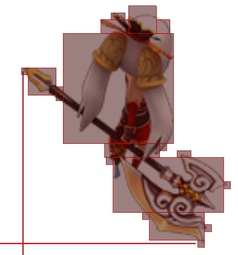

# 框架的结构

模块分成这几类：

* 通用组件

最底层的不依赖于其他模块，比如文件系统、日志、异常检查等。

* 工具类

比如数学库、内存管理、任务系统等。

* 具体资源相关

文字排版、粒子特效、动画、mesh、音效管理等。

* 预处理工具

工具链的模块，比如合贴图、图片处理等。

* 场景树

不同的结构，早期是Symbol-Sprite，之后是SceneNode-Component， 还有ECS

* 渲染相关

底层api的封装、贴图合批、shader管理等。

* 序列化

不同场景树的序列化模块，输入输出对应编辑器的json和游戏用的二进制格式。

* GUI

编辑器的GUI用的wxWidgets，正在替换掉，统一编辑器和游戏用的GUI，改善UI制作工作流程，提高迭代效率。

* 封装层

facade模式，有用C++以及lua封装的模块。
从这里开始分叉，上面的作为底层模块，之后的分出了编辑器、工具链、runtime这3个上层模块部分。

* 编辑器基础模块

跟编辑器相关的通用模块，比如编辑操作、undo redo、视图等部分的模块。

* 编辑器扩展模块

专用的某一方向的组件，比如动画、蓝图、可视化编辑shader、原型工具等。

* 资源编辑器

编译成exe的部分，针对具体某一类型的资源进行编辑。比如动画、粒子、mesh、富文本、场景树、ui等。

* 场景编辑器

跟具体游戏相关的地编工具。

* 工具链

* runtime

# 具体模块简介

## 通用组件

* [cu](https://github.com/xzrunner/cu)
通用的类、宏定义

* [fs](https://github.com/xzrunner/fs)
文件系统

* [logger](https://github.com/xzrunner/logger)
日志

* [ds](https://github.com/xzrunner/ds)
c的常用数据结构

* [guard](https://github.com/xzrunner/guard)
异常、检查

* [cpputil](https://github.com/xzrunner/cpputil)
cpp通用的工具，比如字符串处理。

## 工具类

* [sm](https://github.com/xzrunner/sm)
数学库

* [memmgr](https://github.com/xzrunner/memmgr)
内存管理

* [tasks](https://github.com/xzrunner/tasks)
早期用的pthread的封装，现在用std的thread了

* [multitask](https://github.com/xzrunner/multitask)
多线程管理

* [glp](https://github.com/xzrunner/glp)
游戏循环，计时

* [stat](https://github.com/xzrunner/stat)
统计信息

* [halfedge](https://github.com/xzrunner/halfedge)
半边数据结构，最开始是为了支持加载quake的数据。

* [primitive](https://github.com/xzrunner/primitive)
基础图元，path、bezier等。

## 具体资源相关

* [gtxt](https://github.com/xzrunner/gtxt)
文字排版、字模管理，支持[富文本](https://github.com/xzrunner/gtxt/wiki/Richtext)

* [polymesh](https://github.com/xzrunner/polymesh)
2d mesh网格

* [ps](https://github.com/xzrunner/ps)
粒子特效

* [mtrail](https://github.com/xzrunner/mtrail)
拖尾特效

* [rigging](https://github.com/xzrunner/rigging)
2d骨骼动画，mesh变形动画，支持[Spine](http://zh.esotericsoftware.com/)输出的动画数据模型，与官方runtime相比内存占用更少更紧凑。

* [uniaudio](https://github.com/xzrunner/uniaudio)
音频资源管理和播放。底层音频api的封装，支持OpenAL和OpenSLES。运行时混合多条音轨，绕开硬件限制。

* [anim](https://github.com/xzrunner/anim)
2D动画的层-关键帧结构

* [emitter](https://github.com/xzrunner/emitter)
发射器类型特效（前面的ps和mtrail）的cpp封装

* [geoshape](https://github.com/xzrunner/geoshape)
基本几何图形

* [model](https://github.com/xzrunner/model)
3D模型和动画

## 预处理工具

* [pimg](https://github.com/xzrunner/pimg)
图片处理工具，包括裁剪、压缩、格式转换。支持压缩贴图，支持把图片裁成多个小矩形从而来减少贴图占的内存，包体大小，渲染时的带宽占用和填充开销。

* [texpack](https://github.com/xzrunner/texpack)
合图。用在资源打包时，也用在运行时的动态合并贴图。

## 场景树

* [sprite2](https://github.com/xzrunner/sprite2)
Symbol-Sprite的结构，用在了早期的编辑器和[全民英杰传](http://yjz.zisngame.com/)中。

* [flatten](https://github.com/xzrunner/flatten)
把树结构展平，对sprite2的优化，减少函数调用开销、提高cache命中率。

* [node0](https://github.com/xzrunner/node0)
现在在用的结构，game object系列，SceneNode-Components结构，比之前的减少了继承的使用、更灵活、方便扩展。

* [node2](https://github.com/xzrunner/node2) [node3](https://github.com/xzrunner/node3)
分别是对应上面在2d和3d中的components和systems

* [entity0](https://github.com/xzrunner/entity0) [entity2](https://github.com/xzrunner/entity2) [entity3](https://github.com/xzrunner/entity3)
对应上面的ECS系列，实验用，没正式用。

## 渲染相关

* [unirender](https://github.com/xzrunner/unirender)
底层图形api的封装，目前还只有opengl。

* [ShaderLab](https://github.com/xzrunner/ShaderLab)
shader管理，用在了早期的编辑器和全民英杰传](http://yjz.zisngame.com/)中。提取出原子组件，运行时动态拼装成要用的shader。合并类似的shader，组装成相同的顶点格
式，减少状态切换。

* [dtex](https://github.com/xzrunner/dtex)
为了减少drawcall，运行时合并贴图。用在了[陌陌争霸](https://www.immomogame.com/mmzb)中

* [dtex2](https://github.com/xzrunner/dtex2)
重构dtex，改成cpp来写。用在了[全民英杰传](http://yjz.zisngame.com/)中

* [cooking](https://github.com/xzrunner/cooking)
用多线程来优化渲染效率，用draw list取代之前的立即模式。只是demo，没正式用。

* [painting0](https://github.com/xzrunner/painting0) [painting2](https://github.com/xzrunner/painting2) [painting3](https://github.com/xzrunner/painting3)
渲染相关的工具，包括子模块的封装，和一些没有对应子模块的内容就放到了这里。类似node分成了：通用、2d和3d三类。

* [terr](https://github.com/xzrunner/terr)
地形渲染，ROAM

* [vtex](https://github.com/xzrunner/vtex)
Virtual texture, clipmap.

* [shaderweaver](https://github.com/xzrunner/shaderweaver)
shader片段，可视化shader编辑工具的后端。

* [rendergraph](https://github.com/xzrunner/rendergraph)
shader管理。

* [tessellation](https://github.com/xzrunner/tessellation)
把基础图形渲染成用三角形来表示。

## 序列化

* [bimp](https://github.com/xzrunner/bimp) [timp](https://github.com/xzrunner/timp) [simp](https://github.com/xzrunner/simp) 在[全民英杰传](http://yjz.zisngame.com/)中用的，分别对应通用基类、图片和场景树的序列化。

* [s2serializer](https://github.com/xzrunner/s2serializer) [s2loader](https://github.com/xzrunner/s2loader) [s2storer](https://github.com/xzrunner/s2storer) sprite2场景树的序列化。

* [nserializer](https://github.com/xzrunner/nserializer) [eserializer](https://github.com/xzrunner/eserializer) [serializerx](https://github.com/xzrunner/serializerx) node和entity场景树的序列化。

* [gimg](https://github.com/xzrunner/gimg)
图片导入导出

* [bs](https://github.com/xzrunner/bs)
二进制序列化通用组件。

* [js](https://github.com/xzrunner/js)
json列化通用组件。

* [playdb](https://github.com/xzrunner/playdb)
轻量化，B树的数据库，用来重构之前的序列化模块，统一游戏中用到的资源，包括配表信息和美术数据（还没完成）。

* [lexer](https://github.com/xzrunner/lexer)
词法解析，解析特定格式的资源文件。比如quake的map文件。

## GUI

* [easygui](https://github.com/xzrunner/easygui)

立即模式的GUI，与[dear imgui](https://github.com/ocornut/imgui)相比：

1. 有cache，不用每次重新画。每个控件分成update和draw，update每帧调用，draw只有脏时才调用来计算三角形面片，组装顶点缓存，更新vbo。

2. update和draw只是返回新状态，不改变全局和内部状态。为热加载和多线程准备。

3. 更容易支持动画这种需要内部状态的功能，可以把控件内部状态统一放在一块内存上，为像redux一样支持时间旅行做准备。或者结合[playdb](https://github.com/xzrunner/playdb)把状态持久化，解决游戏中复杂ui相互引用，释放不掉，浪费内存的问题。（3还没完成）

## 封装层

* [gum](https://github.com/xzrunner/gum)
早期用在[全民英杰传](http://yjz.zisngame.com/)中的子模块的封装层，还包括了部分序列化的内容

* [facade](https://github.com/xzrunner/facade)
现在用的子模块的封装层

* [moon](https://github.com/xzrunner/moon)
Lua封装层

## 编辑器基础模块

* [easyeditor](https://github.com/xzrunner/easyeditor/tree/master/easyeditor)
[陌陌争霸](https://www.immomogame.com/mmzb)和[全民英杰传](http://yjz.zisngame.com/)中用的老版本的编辑器

* [easyeditor0](https://github.com/xzrunner/easyeditor0) [easyeditor2](https://github.com/xzrunner/easyeditor2) [easyeditor3](https://github.com/xzrunner/easyeditor3) 现在编辑器的基础模块，类似之前分别对应通用、2d和3d部分。包括了编辑操作、undo redo、视图等部分的模块。现在还用的wxWidgets，正在用easygui来重构。

## 编辑器扩展模块

* [eanim](https://github.com/xzrunner/eanim)
通用动画部分，包括时间轴、图层等。

* [blueprint](https://github.com/xzrunner/blueprint)
可视化逻辑编辑工具的通用前端部分。

* [shadergraph](https://github.com/xzrunner/shadergraph)
基于blueprint的shader可视化编辑器的前端部分。

* [prototyping](https://github.com/xzrunner/prototyping)
原型工具参考了[axure](https://www.axure.com/)，为了改善UI制作工作流程，提高迭代效率。还未完成。

工作流变成：
1. 策划通过可视化工具生成ui tree
2. 美术在ui tree基础上制作res tree
3. 程序在ui tree基础上写逻辑

其中2和3可以并行。策划改方案的话ui tree是工具生成的，可以自动处理。美术改方案的话美术来绑定ui tree和res tree。这两种改动都不需要程序来改代码。

* [drawing2](https://github.com/xzrunner/drawing2)
绘制2d几何图形

## 资源编辑器

* 老版本编辑器，比如[easycomplex](editor/easycomplex/index.md)组装成场景树的编辑器。[easyanimation](editor/easyanimation/index.md)动画编辑器。[easyscale9](editor/easyscale9/index.md)九宫格编辑器。

* [easyone](https://github.com/xzrunner/easyone) 新版本的编辑器，模仿unity和unreal。

## 场景编辑器

* [sg](https://github.com/xzrunner/easyeditor/tree/master/sg)
[陌陌争霸](https://www.immomogame.com/mmzb)的地编工具.

* [lr](https://github.com/xzrunner/easyeditor/tree/master/lr)
[全民英杰传](http://yjz.zisngame.com/)的地编工具.

## 工具链和运行时

* [toolchain](https://github.com/xzrunner/toolchain)

* [runtime](https://github.com/xzrunner/runtime)

## 在简悦的项目中用到的模块

[陌陌争霸](https://www.immomogame.com/mmzb)项目的编辑器，包括资源编辑器、场景编辑器和工具链：
easyeditor，ds, dtex, fs, gum, glp, gtxt, ps, shaderlab, sprite2

[陌陌争霸](https://www.immomogame.com/mmzb)和[心动庄园](https://www.immomogame.com/farm)的游戏中用了dtex来优化drawcall

S3项目在用陌陌争霸的编辑器

[全民英杰传](http://yjz.zisngame.com/)的引擎和编辑器以及工具链：
bimp, bs, camera25, cooking, cu, ds, dtex, dtex2, flatten, fs, gimg, glp, gtxt, guard, gum, js, logger, memmgr, mtrail, multitask, pimg, playdb, polymesh, rapidvg, rigging, shaderlab, simp, sm, sprite2, tasks, texpack, timp, uniqudio, unirender

# 其他

## 移植游戏

* [quake](https://github.com/xzrunner/quake)
目前只支持quake1的数据，只做了数据加载和显示。

* [sample3rd](https://github.com/xzrunner/sample3rd)
love2d的例子.

## 学习的项目

* [raytracer](https://github.com/xzrunner/raytracer)
跟着《Ray Tracing from the Ground Up》这本书，学习光线追踪。

* [t3d](https://github.com/xzrunner/t3d)
跟着《Tricks of the 3D Game Programming Gurus》这本书，学习软渲染。

## 老代码

* [sde](https://github.com/xzrunner/sde) 上学时候的一个空间数据库引擎（2008-2011）

* [doodle_editor](https://github.com/xzrunner/doodle_editor) 早期做游戏写的一些2d编辑器（2011-2013）

## 做过的游戏

* [Tilt Racing](https://play.google.com/store/apps/details?id=com.zz.thumbracing)

* [Bike Xtreme](https://play.google.com/store/apps/details?id=com.zz.motox)

* [陌陌争霸](https://www.immomogame.com/mmzb)

* [全民英杰传](http://yjz.zisngame.com/)
